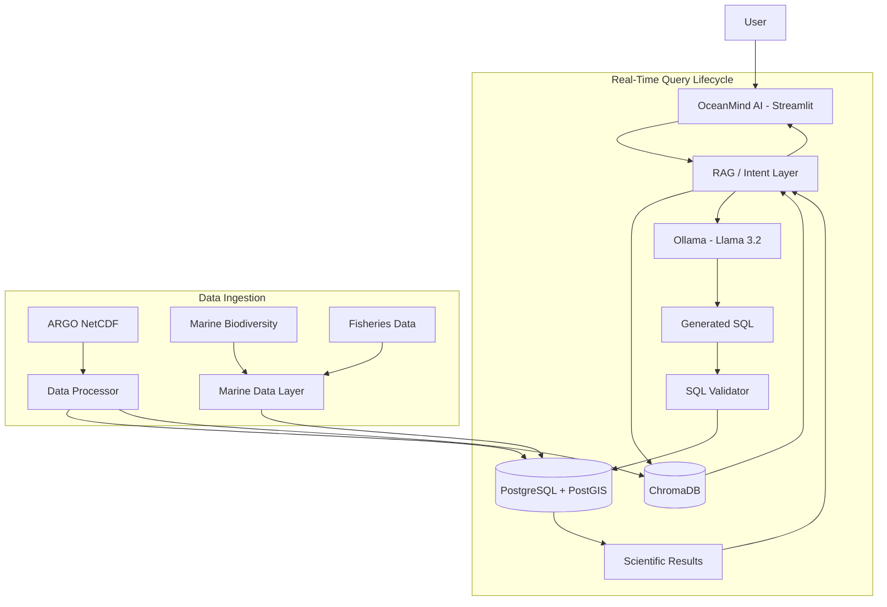

# OceanMind AI

> **AI-Driven Unified Marine Intelligence Platform**  
> Natural-language exploration of oceanographic, biodiversity, and fisheries data.

[](https://www.python.org/)
[](https://streamlit.io/)
[](https://www.postgresql.org/)
[](https://ollama.com/)
[](https://www.trychroma.com/)

OceanMind AI is a conversational marine-intelligence platform that helps users explore complex scientific datasets without requiring SQL, GIS, programming, or database-schema knowledge. Users can ask questions in plain English and receive grounded answers, validated database queries, interactive visualizations, and source-aware scientific insights.

The project combines **ARGO oceanographic observations**, **marine biodiversity data**, and **fisheries information** behind a unified natural-language interface.


## Why OceanMind AI?

Marine datasets are scientifically valuable but difficult to work with directly. Oceanographic observations are often distributed in formats such as NetCDF, while biodiversity and fisheries datasets may have different schemas, spatial conventions, and metadata.

OceanMind AI reduces that complexity by providing one conversational workflow:

**Ask → Understand → Query → Validate → Analyze → Visualize → Explain**

Instead of manually writing SQL or navigating raw scientific files, users can ask questions such as:

- *What is the average temperature below 500 m?*
- *Which ARGO floats are located in the Arabian Sea?*
- *Show the temperature and salinity profile for a specific float.*
- *Which marine species have been observed near Chennai?*
- *Compare fisheries observations with nearby ocean conditions.*

---

## Core Capabilities

### Natural-Language Marine Queries
Ask scientific questions in plain English without knowing the underlying database schema.

### AI-Assisted SQL Generation
A local Ollama-hosted LLM converts user intent into PostgreSQL queries.

### SQL Validation
Generated SQL is checked before execution to reduce invalid or unsafe queries.

### Retrieval-Augmented Generation
ChromaDB supplies relevant metadata and contextual information to improve query generation and interpretation.

### Scientific Data Processing
Raw ARGO NetCDF files are parsed with xarray, transformed with pandas/NumPy, and stored in a structured PostgreSQL/PostGIS database.

### Interactive Visualizations
The Streamlit workspace can present applicable:
- geospatial maps,
- depth profiles,
- time-series charts,
- descriptive statistics,
- correlation matrices,
- result tables.

### Geospatial Analysis
PostGIS supports spatial questions such as nearby-float and location-based exploration.

### Multi-Domain Marine Intelligence
The platform is designed around three marine-data domains:

| Domain | Primary Role |
|---|---|
| **ARGO** | Oceanographic observations such as temperature, salinity, pressure/depth, time, and position |
| **OBIS / Biodiversity** | Marine species-occurrence and biodiversity observations |
| **Fisheries** | Fisheries-related observations and representative datasets |
| **Cross-Domain Analysis** | Combined interpretation across available marine datasets |

### Data Provenance
OceanMind distinguishes between observed/source data, representative datasets, calculated outputs, and AI interpretation rather than presenting every result as equivalent evidence.

### Local-First AI
The AI engine can run through Ollama on the host machine/server, avoiding mandatory dependence on paid LLM APIs.

---

## Technology Stack

| Layer | Technology |
|---|---|
| **Frontend / Workspace** | Streamlit |
| **Backend** | Python |
| **LLM Runtime** | Ollama |
| **Model** | Llama 3.2 |
| **AI / RAG Framework** | LangChain |
| **Relational Database** | PostgreSQL |
| **Geospatial Extension** | PostGIS |
| **Vector Store** | ChromaDB |
| **Data Processing** | xarray, pandas, NumPy |
| **Visualizations** | Plotly |
| **Scientific Data Format** | NetCDF |

---

## System Architecture



The architecture separates **data ingestion** from the **real-time query lifecycle**, allowing scientific data preparation and user-facing analysis to remain modular.

---

## ARGO Data Ingestion Workflow

1. Place raw ARGO NetCDF (`.nc`) files in the configured data directory.
2. The data processor opens each file using **xarray**.
3. Relevant variables such as temperature, salinity, pressure/depth, time, and position are extracted.
4. Multi-dimensional observations are flattened into tabular form with **pandas**.
5. Structured observations are inserted into PostgreSQL/PostGIS.
6. Float metadata is summarized for retrieval.
7. Metadata embeddings are persisted in **ChromaDB**.

This creates both:
- a structured SQL layer for deterministic analysis, and
- a vector context layer for RAG-assisted query generation.

---

## Conversational Query Lifecycle

When a user asks a question:

1. OceanMind receives the natural-language query.
2. The RAG layer identifies relevant context.
3. ChromaDB retrieves matching metadata.
4. The application constructs an augmented prompt using schema information, retrieved context, SQL-generation rules, and the original question.
5. Ollama generates PostgreSQL SQL.
6. The SQL validator checks the generated query.
7. The validated query runs against PostgreSQL/PostGIS.
8. Returned observations are analyzed deterministically where applicable.
9. OceanMind generates a human-readable scientific explanation.
10. Streamlit displays the explanation, source data, technical query details, and applicable visualizations.

---

## Project Structure

```text
OceanMind-AI/
├── dashboard.py                # Streamlit UI and interaction layer
├── theme.py                    # OceanMind visual design system
├── rag_system.py               # RAG + LLM query workflow
├── sql_validator.py            # SQL validation and safety checks
├── database_manager.py         # PostgreSQL/PostGIS access
├── data_processing.py          # ARGO NetCDF ingestion
├── data_processing_verbose.py  # Verbose ingestion utility
├── marine_data.py              # Fisheries / biodiversity data layer
├── marine_analysis.py          # Marine analysis utilities
├── obis_client.py              # OBIS integration
├── proximity.py                # Spatial proximity support
├── config.py                   # Application configuration
├── requirements.txt            # Python dependencies
├── env.example                 # Environment-variable template
└── data/                       # Local scientific data files
```

> The exact contents of the `data/` directory depend on the local/server deployment and may not be fully stored in Git.

---

## Local Setup

### Prerequisites

Install:

- Python 3.10+
- PostgreSQL
- PostGIS
- Ollama
- Git

### 1. Clone the repository

```bash
git clone https://github.com/abishekdvlpr/OceanMind-AI.git
cd OceanMind-AI
```

### 2. Create a virtual environment

**Windows PowerShell**

```powershell
python -m venv .venv
.\.venv\Scripts\Activate.ps1
```

**Linux / macOS**

```bash
python -m venv .venv
source .venv/bin/activate
```

### 3. Install dependencies

```bash
python -m pip install --upgrade pip
pip install -r requirements.txt
```

### 4. Configure PostgreSQL + PostGIS

Create the database and user:

```sql
CREATE USER argo_user WITH PASSWORD 'your_password';
CREATE DATABASE argo_db OWNER argo_user;
```

Connect to `argo_db` as a PostgreSQL superuser and enable PostGIS:

```sql
CREATE EXTENSION IF NOT EXISTS postgis;
```

### 5. Configure Ollama

Install Ollama and pull the required model:

```bash
ollama pull llama3.2
```

Confirm the model is available:

```bash
ollama list
```

### 6. Configure environment variables

Create a local environment file from the example:

**Windows PowerShell**

```powershell
Copy-Item env.example .env
```

**Linux / macOS**

```bash
cp env.example .env
```

Configure the values for your environment, including PostgreSQL and Ollama settings.

Typical local values include:

```env
PGHOST=localhost
PGPORT=5432
PGDATABASE=argo_db
PGUSER=argo_user
PGPASSWORD=your_password

OLLAMA_BASE_URL=http://localhost:11434
OLLAMA_MODEL=llama3.2:latest
```

> Never commit real passwords, API credentials, or `.env` files to Git.

### 7. Load scientific data

Place ARGO `.nc` files in the configured `data/` directory.

You can then use the application's **Ingest ARGO Dataset** control or the project ingestion utilities to populate PostgreSQL and ChromaDB.

Marine biodiversity and fisheries datasets can be initialized through their corresponding application controls when configured.

### 8. Run OceanMind AI

```bash
streamlit run dashboard.py
```

Open the local URL shown by Streamlit, normally:

```text
http://localhost:8501
```

---

## Example Queries

```text
Show the temperature and salinity profile for float 2903140
```

```text
Which floats are located in the Arabian Sea?
```

```text
What is the average temperature below 500 m depth?
```

```text
Show biodiversity near Chennai
```

```text
Species recorded in the Bay of Bengal
```

```text
Compare fish catch with sea-surface temperature by zone
```

---

## Deployment Note

A complete public deployment requires more than hosting the Python source code.

The deployed environment must provide shared access to:

- the Streamlit application,
- PostgreSQL/PostGIS,
- persistent ChromaDB storage,
- Ollama and its model,
- the required scientific datasets.

For this reason, static hosts such as GitHub Pages are not sufficient for the full application. A persistent server/container deployment is recommended so that all users query the same ingested datasets.

---

## Security & Data Handling

- Keep `.env` and database credentials outside version control.
- Use a restricted PostgreSQL account for the deployed application.
- Keep public query execution read-only where possible.
- Perform dataset ingestion from trusted administrative workflows.
- Validate generated SQL before execution.
- Do not expose administrative ingestion controls unnecessarily on public deployments.

---

## Current Scope

OceanMind AI currently focuses on conversational exploration and analysis of available marine datasets through a unified scientific workspace.

The platform is designed to preserve transparency by exposing source context, generated SQL, result data, and applicable visualizations instead of presenting an AI-generated response without evidence.

---

## Future Work

Potential extensions include:

- additional in-situ datasets such as BGC-Argo, gliders, and buoys,
- satellite ocean-observation products,
- broader fisheries data integration,
- additional marine biodiversity and molecular datasets,
- expanded scientific provenance metadata,
- improved caching for repeated analytical queries,
- scalable cloud-native deployment,
- additional export formats such as NetCDF and ASCII.

---

## Acknowledgements

OceanMind AI builds on open scientific and open-source ecosystems including:

- the international **ARGO** ocean-observation program,
- **OBIS** marine biodiversity infrastructure,
- PostgreSQL / PostGIS,
- Streamlit,
- Ollama,
- ChromaDB,
- LangChain,
- Plotly,
- xarray,
- pandas,
- NumPy.

Dataset licences and source-specific attribution should be retained with the corresponding records where applicable.

---

## License

No software licence was specified in the supplied repository README.

Before public reuse or distribution, add an explicit licence file appropriate to the project and verify the licences/attribution requirements of all included datasets.

---

<p align="center">
  <strong>OceanMind AI</strong><br>
  Unified Marine Intelligence through natural language.
</p>
